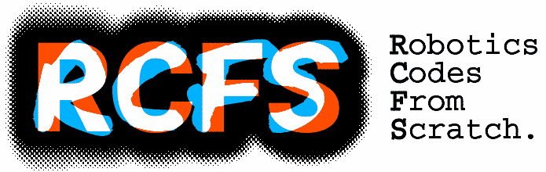

Robotics codes from scratch (RCFS) is a collection of source codes to study and test learning and optimization problems in robotics through simple 2D examples. Most examples are coded in Python and Matlab/Octave (full compatibility with GNU Octave). Some are also coded in C++ and Julia. The code examples have .m, .py, .cpp and .jl extensions that can be found in their respective folders matlab, python, cpp and julia. 

RCFS comes with an accompanying [PDF](./doc/rcfs.pdf) containing the corresponding descriptions of the algorithms.

The RCFS website also includes interactive exercises: [https://rcfs.ch](https://rcfs.ch)

### List of examples

| Filename | Description | .m | .py | .cpp | .jl |
|----------|-------------|----|-----|------|-----|
| MP | Movement primitives with various basis functions | ✅ | ✅ |  |  |
| spline2D | Concatenated Bernstein basis functions with constraints to encode a signed distance function (2D inputs, 1D output) | ✅ | ✅ |  |  |
| spline2D_eikonal | Gauss-Newton optimization of an SDF encoded with concatenated cubic polysplines, by considering unit norm derivatives in the cost function | ✅ | ✅ |  |  |
| IK | Inverse kinematics for a planar manipulator | ✅ | ✅ | ✅ | ✅ |
| IK_bimanual | Inverse kinematics with a planar bimanual robot |  | ✅ |  |  |
| IK_nullspace | Inverse kinematics with nullspace projection (position and orientation tracking as primary or secondary tasks) | ✅ | ✅ |  |  |
| IK_num | Inverse kinematics with numerical computation for a planar manipulator | ✅ | ✅ |  |  |
| FD | Forward Dynamics computed for a planar manipulator | ✅ | ✅ |  |  |
| LQR_infHor | Infinite Horizon Linear quadratic regulator (LQR) applied to a point mass system | ✅ | ✅ |  |  |
| LQT | Linear quadratic tracking (LQT) applied to a viapoint task (batch formulation) | ✅ | ✅ |  |  |
| LQT_tennisServe | LQT in a ballistic task mimicking a bimanual tennis serve problem (batch formulation) | ✅ | ✅ |  |  |
| LQT_recursive | LQT applied to a viapoint task with a recursive formulation based on augmented state space to find a controller) | ✅ | ✅ |  |  |
| LQT_nullspace | Batch LQT with nullspace formulation | ✅ | ✅ |  |  |
| LQT_recursive_LS | LQT applied to a viapoint task with a recursive formulation based on least squares and an augmented state space to find a controller | ✅ | ✅ |  |  |
| LQT_recursive_LS_multiAgents | LQT applied to a multi-agent system with recursive formulation based on least squares and augmented state, by using a precision matrix with nonzero offdiagonal elements to find a controller in which the two agents coordinate their movements to find an optimal meeting point | ✅ | ✅ |  |  |
| LQT_CP | LQT with control primitives applied to a viapoint task (batch formulation) | ✅ | ✅ |  |  |
| LQT_CP_DMP | LQT with control primitives applied to trajectory tracking with a formulation similar to dynamical movement primitives (DMP), by using the least squares formulation of recursive LQR on an augmented state space | ✅ | ✅ |  |  |
| iLQR_distMaintenance | Iterative linear quadratic regulator (iLQR) applied to a 2D point-mass system with the objective of constantly maintaining a desired distance to an object | ✅ |  |  |  |
| iLQR_obstacle | iLQR applied to a viapoint task with obstacles avoidance (batch formulation) | ✅ | ✅ |  |  |
| GPIS | Gaussian process implicit surfaces (GPIS) |  | ✅ |  |  |
| iLQR_obstacle_GPIS | iLQR with obstacles represented as Gaussian process implicit surfaces (GPIS) | ✅ | ✅ | ✅ |  |
| iLQR_manipulator | iLQR applied to a planar manipulator for a viapoints task (batch formulation) | ✅ | ✅ | ✅ | ✅ |
| iLQR_manipulator_recursive | iLQR applied to a planar manipulator for a viapoints task (recursive formulation to find a controller) | ✅ | ✅ |  |  |
| iLQR_manipulator_CoM | iLQR applied to a planar manipulator for a tracking problem involving the center of mass (CoM) and the end-effector (batch formulation) | ✅ | ✅ |  |  |
| iLQR_manipulator_obstacle | iLQR applied to a planar manipulator for a viapoints task with obstacles avoidance (batch formulation) | ✅ | ✅ |  |  |
| iLQR_manipulator_CP | iLQR with control primitives applied to a viapoint task with a manipulator (batch formulation) | ✅ | ✅ |  |  |
| iLQR_manipulator_object_affordance | iLQR applied to an object affordance planning problem with a planar manipulator, by considering object boundaries (batch formulation) | ✅ | ✅ |  |  |
| iLQR_manipulator_dynamics | iLQR applied to a reaching task by considering the dynamics of the manipulator | ✅ | ✅ |  |  |
| iLQR_bimanual | iLQR applied to a planar bimanual robot for a tracking problem involving the center of mass (CoM) and the end-effector (batch formulation) | ✅ | ✅ |  |  |
| iLQR_bimanual_manipulability | iLQR applied to a planar bimanual robot problem with a cost on tracking a desired manipulability ellipsoid at the center of mass (batch formulation) | ✅ | ✅ |  |  |
| iLQR_bicopter | iLQR applied to a bicopter problem (batch formulation) | ✅ | ✅ | ✅ |  |
| iLQR_car | iLQR applied to a car parking problem (batch formulation) | ✅ | ✅ | ✅ |  |
| ergodic_control_HEDAC | 2D ergodic control formulated as Heat Equation Driven Area Coverage (HEDAC) objective |  | ✅ |  |  |
| ergodic_control_SMC | 2D ergodic control formulated as Spectral Multiscale Coverage (SMC) objective | ✅ | ✅ |  |  |

### Maintenance, contributors and licensing

RCFS is maintained by Sylvain Calinon, https://calinon.ch/

Contributors: Sylvain Calinon, Philip Abbet, Jérémy Maceiras, Hakan Girgin, Julius Jankowski, Teguh Lembono, Tobias Löw, Amirreza Razmjoo, Boyang Ti, Teng Xue, Yifei Dong, Yiming Li, Cem Bilaloglu, Yan Zhang, Guillaume Clivaz

Copyright (c) 2023 Idiap Research Institute, https://idiap.ch/

RCFS is licensed under the MIT License.

